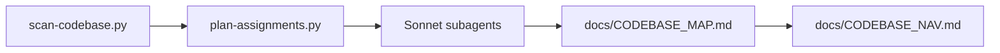

# Mapper


An agent-agnostic codebase mapper that can be used as a Claude Code plugin.
Fast scans, incremental updates, and token-aware planning built in.

```
+-----------+    +-----------------+    +-------------------+    +----------------------+
| scan repo | -> | plan assignments | -> | parallel subagents | -> | CODEBASE_MAP + NAV   |
+-----------+    +-----------------+    +-------------------+    +----------------------+
```



## What it does

- Scans the repo with git-aware file listing and caching.
- Plans subagent groups by token budgets.
- Produces a full map and a quick navigation guide.
- Supports incremental updates with git diff helpers.
- Surface entrypoints, top files, and churn hotspots.
- Emits module hashes to compare against previous scans.
- Generates risk signals (TODO/FIXME/HACK, large files, missing tests, churn).
- Merges risk signals into the main map when requested.

## Installation

### Via Claude Code Plugins Registry

```bash
claude plugins install mapper
```

### Manual Installation

```bash
git clone <repo-url> ~/.claude/skills/mapper
```

Or per-project:

```bash
git clone <repo-url> .claude/skills/mapper
```

### Standalone (any agent)

You can use the scripts directly without Claude Code:

```bash
python3 skills/mapper/scripts/scan-codebase.py . --format json --out .claude/mapper/scan.json
python3 skills/mapper/scripts/risk-signals.py .claude/mapper/scan.json --out docs/RISK_SIGNALS.md
```

## Dependencies

By default Mapper uses `tiktoken` for accurate token counts. If you prefer zero installs, set `--tokenizer heuristic`.

```bash
pip install tiktoken
# optional
pip install pathspec
```

## Usage

Invoke the skill:

```
/mapper
```

Or ask: "map this codebase".

If you are using another agent, follow the CLI quick start below and point your agent to the generated docs.

## Quick Start (CLI)

1) Scan the repo:

```bash
python3 skills/mapper/scripts/scan-codebase.py . \
  --format json \
  --out .claude/mapper/scan.json
```

2) Plan subagent buckets:

```bash
python3 skills/mapper/scripts/plan-assignments.py \
  .claude/mapper/scan.json \
  --max-tokens 150000 \
  --out .claude/mapper/assignments.txt
```

3) Generate risk signals:

```bash
python3 skills/mapper/scripts/risk-signals.py \
  .claude/mapper/scan.json \
  --out docs/RISK_SIGNALS.md
```

4) Merge risk signals into the map (after map is created):

```bash
python3 skills/mapper/scripts/merge-risk-signals.py \
  --map docs/CODEBASE_MAP.md \
  --risk docs/RISK_SIGNALS.md
```

## Update Mode (Incremental)

If `docs/CODEBASE_MAP.md` already exists, Mapper can update only what changed.

1) Get changed files from git:

```bash
python3 skills/mapper/scripts/git-changes.py . \
  --since-commit <last_commit> \
  --out .claude/mapper/changed.txt
```

Optional: rescan only changed files for faster incremental work:

```bash
python3 skills/mapper/scripts/scan-codebase.py . \
  --format json \
  --changed-list .claude/mapper/changed.txt \
  --out .claude/mapper/scan.json
```

2) Plan only affected modules:

```bash
python3 skills/mapper/scripts/plan-assignments.py \
  .claude/mapper/scan.json \
  --changed-list .claude/mapper/changed.txt \
  --changed-scope modules \
  --out .claude/mapper/assignments.txt
```

Optional: compute module-level changes against a previous scan:

```bash
python3 skills/mapper/scripts/scan-codebase.py . \
  --format json \
  --prev-scan .claude/mapper/scan.prev.json \
  --out .claude/mapper/scan.json
```

## How it works

```
/mapper invoked
        |
        v
+---------------------------------------+
|  1. Run scan-codebase.py              |
|     - file tree + tokens + metadata   |
|     - cache + git-aware listing       |
+---------------------------------------+
        |
        v
+---------------------------------------+
|  2. Plan subagent assignments         |
|     - group by module                 |
|     - balance token budgets           |
+---------------------------------------+
        |
        v
+---------------------------------------+
|  3. Spawn Sonnet subagents PARALLEL   |
|     - analyze assigned files          |
|     - return structured summaries     |
+---------------------------------------+
        |
        v
+---------------------------------------+
|  4. Synthesize all reports            |
|     - merge + dedupe + cross-cutting  |
+---------------------------------------+
        |
        v
+---------------------------------------+
|  5. Write docs/CODEBASE_MAP.md        |
|     Write docs/CODEBASE_NAV.md        |
|     Update CLAUDE.md + AGENTS.md      |
+---------------------------------------+
```

## Plugin Layout

```
.claude-plugin/
  plugin.json
skills/mapper/
  SKILL.md
  scripts/
    scan-codebase.py
    plan-assignments.py
    git-changes.py
    skeletonize.py
    risk-signals.py
    merge-risk-signals.py
docs/
  CODEBASE_MAP.md
  CODEBASE_NAV.md
  RISK_SIGNALS.md
```

## Output Structure

Outputs (recommended):

```
./docs/
  CODEBASE_MAP.md
  CODEBASE_NAV.md
  RISK_SIGNALS.md
```

`RISK_SIGNALS.md` is optional and generated via `risk-signals.py`.
Also updates `CLAUDE.md` and `AGENTS.md` (if present) with a short summary and link to the map.

`CLAUDE.md` and `AGENTS.md` are intended as entry points for new sessions and should point to:
`docs/CODEBASE_MAP.md`, `docs/CODEBASE_NAV.md`, and `docs/RISK_SIGNALS.md`.

`docs/CODEBASE_MAP.md` includes:

- System overview + architecture diagram
- Directory structure (annotated tree)
- Module guide (purpose, entrypoints, dependencies)
- Data flows (Mermaid sequence diagrams)
- Conventions and gotchas
- Risks and hotspots
- Risk signals summary (TODO/FIXME, large files, missing tests, churn)
- Navigation guide for common tasks

`docs/CODEBASE_NAV.md` includes:

- One-page quick navigation
- Main entrypoints and where to make changes

`docs/RISK_SIGNALS.md` includes:

- TODO/FIXME/HACK/XXX counts
- Large files by tokens and size
- Test file detection
- Churn hotspots

To embed risk signals into the main map:

```bash
python3 skills/mapper/scripts/merge-risk-signals.py \
  --map docs/CODEBASE_MAP.md \
  --risk docs/RISK_SIGNALS.md
```

## Claude / Agents Notes

If you want consistent onboarding for future sessions, keep these files updated:

- `CLAUDE.md`: short overview + links to generated docs.
- `AGENTS.md`: per-agent hints + links to generated docs.

## Using with Other Agents

Mapper is not tied to Claude. The outputs are plain markdown, so you can:

1) Run the CLI flow to generate `docs/CODEBASE_MAP.md`, `docs/CODEBASE_NAV.md`, and `docs/RISK_SIGNALS.md`.
2) Add or update `AGENTS.md` with links to those docs.
3) In your agent prompt, reference the docs as the primary context.

Example `AGENTS.md`:

```markdown
# Agent Notes

Use the generated docs as the primary source of truth:
- docs/CODEBASE_MAP.md
- docs/CODEBASE_NAV.md
- docs/RISK_SIGNALS.md
```

## Token Budgets

| Model | Context Window | Safe Budget per Subagent |
| --- | --- | --- |
| Sonnet | 200,000 | 150,000 |
| Opus | 200,000 | 100,000 |
| Haiku | 200,000 | 100,000 |

## Token Cost Controls

### Skeleton (optional)

Generate a reduced view for a first pass:

```bash
python3 skills/mapper/scripts/skeletonize.py \
  .claude/mapper/scan.json \
  --out .claude/mapper/skeleton.md
```

Use skeletons for orientation, then open full files if anything is unclear.
The script falls back to full files if the skeleton becomes too thin (configurable).

### Other ideas

- Focused scans with `--include`/`--exclude`.
- Limit analysis to changed modules.
- Prioritize entrypoints and hotspots.
- Use `risk-signals.py` to surface TODOs, large files, and missing tests.

## Performance Tips

- Use `--workers N` to parallelize tokenization (0 disables).
- Use `--cache-compress` to gzip the scan cache.
- Use `--git-pathspec` to prefilter include/exclude via git.
- Use `--changed-range` or `--changed-since-commit` to scan only recent changes.
- Use `--tokenizer heuristic` to avoid extra installs.

## Configuration

Mapper auto-detects `.mapper.json` or `.claude/mapper/config.json`.
Copy the template from `.mapper.json.example` to get started.

```json
{
  "use_git": true,
  "git_pathspec": true,
  "workers": 0,
  "cache": true,
  "cache_compress": false,
  "tokenizer": "tiktoken",
  "hash_mode": "fast",
  "max_tokens": 50000,
  "max_size": 1000000,
  "module_depth": 1,
  "churn_commits": 200,
  "entrypoints_limit": 20,
  "top_files": 20,
  "include": ["src/**"],
  "exclude": ["**/*.test.*"],
  "changed_scope": "modules",
  "changed_depth": 1,
  "risk": {
    "patterns": ["TODO", "FIXME", "HACK", "XXX"],
    "tokens_threshold": 5000,
    "size_threshold": 200000,
    "max_items": 50,
    "test_patterns": ["tests/**", "__tests__/**"]
  },
  "skeleton": {
    "max_lines": 400,
    "max_bytes": 200000,
    "keep_head": 30,
    "keep_tail": 20,
    "comment_backtrack": 2,
    "min_keep_lines": 40,
    "min_keep_ratio": 0.05,
    "line_numbers": false,
    "only_skeleton": false
  }
}
```

## Scripts

| Script | Purpose |
| --- | --- |
| `skills/mapper/scripts/scan-codebase.py` | Scan files with tokens, cache, and git metadata |
| `skills/mapper/scripts/plan-assignments.py` | Group files into token-balanced subagent buckets |
| `skills/mapper/scripts/git-changes.py` | List changed files for incremental updates |
| `skills/mapper/scripts/skeletonize.py` | Build a reduced code skeleton for first-pass analysis |
| `skills/mapper/scripts/risk-signals.py` | Emit risk signals (TODOs, large files, missing tests, churn) |
| `skills/mapper/scripts/merge-risk-signals.py` | Merge risk signals into CODEBASE_MAP.md |

## Troubleshooting

**Scanner fails with tiktoken error**

```bash
pip install tiktoken
```

**Python not found**

Try `python3` or use a virtualenv.

**Large files skipped**

Increase `--max-size` or `--max-tokens` (or set in `.mapper.json`).

## License

MIT
