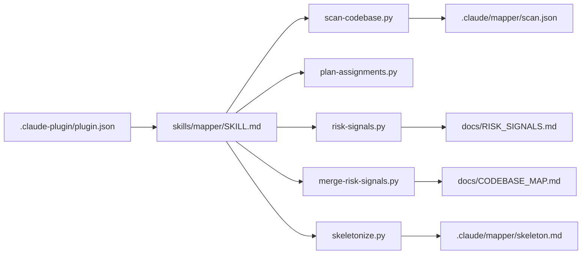
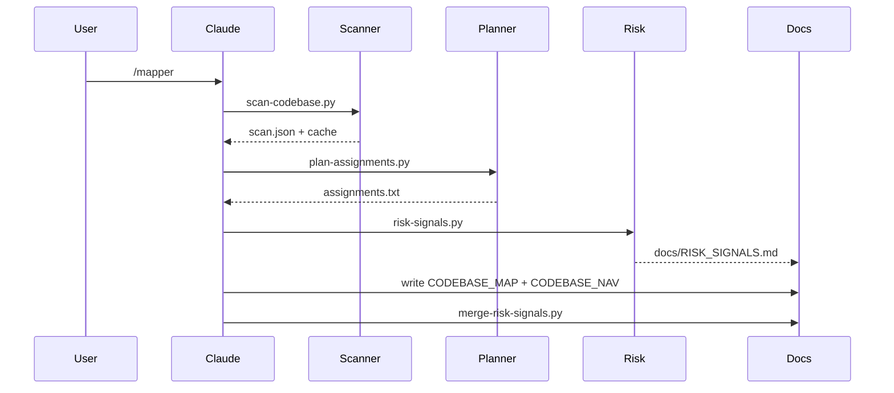

# Codebase Map

> Auto-generated map for the Mapper plugin.

## System Overview

Mapper is a Claude Code plugin implemented as a skill + helper scripts. The plugin manifest provides metadata, the skill orchestrates the flow, and scripts handle scanning, grouping, and optional reporting.



## Directory Structure

```
.
├── .claude-plugin/
│   └── plugin.json
├── .mapper.json
├── .mapper.json.example
├── LICENSE
├── README.md
├── docs/
│   └── RISK_SIGNALS.md
└── skills/
    └── mapper/
        ├── SKILL.md
        └── scripts/
            ├── git-changes.py
            ├── merge-risk-signals.py
            ├── plan-assignments.py
            ├── risk-signals.py
            ├── scan-codebase.py
            └── skeletonize.py
```

Notes:
- `.claude/` and `.venv/` are local artifacts and should not be published.
- `docs/CODEBASE_MAP.md` and `docs/CODEBASE_NAV.md` are generated outputs.

## Module Guide

### Plugin Manifest

**Purpose**: Claude Code plugin metadata.
**Key file**: `.claude-plugin/plugin.json`

### Skill

**Purpose**: Orchestrates scanning, grouping, risk reporting, and documentation output.
**Key file**: `skills/mapper/SKILL.md`

### Scripts

**Purpose**: Standalone utilities used by the skill workflow.

| Script | Purpose |
| --- | --- |
| `skills/mapper/scripts/scan-codebase.py` | Scan files, count tokens, cache results, emit module hashes | 
| `skills/mapper/scripts/plan-assignments.py` | Group files into token-balanced subagent buckets | 
| `skills/mapper/scripts/git-changes.py` | List changed files for incremental updates | 
| `skills/mapper/scripts/skeletonize.py` | Build a reduced skeleton view for cheap first-pass analysis | 
| `skills/mapper/scripts/risk-signals.py` | Emit risk signals (TODOs, large files, missing tests, churn) | 
| `skills/mapper/scripts/merge-risk-signals.py` | Merge risk signals into CODEBASE_MAP.md | 

### Docs

**Purpose**: Generated outputs for navigation and risk visibility.
**Key files**: `docs/CODEBASE_MAP.md`, `docs/CODEBASE_NAV.md`, `docs/RISK_SIGNALS.md`

## Data Flow



## External Interfaces

- Git (optional): `git ls-files`, `git diff`, `git log` for incremental mode and churn.
- Tokenizer: `tiktoken` (default) or heuristic mode if requested.
- Filesystem: reads code files, writes docs and cache.

## Conventions

- Config lives in `.mapper.json` or `.claude/mapper/config.json`.
- Cache and artifacts go under `.claude/mapper/`.
- Generated docs go under `docs/`.

## Gotchas

- Default tokenization expects `tiktoken`; use `--tokenizer heuristic` if you avoid installs.
- If a repo has no git metadata, incremental features fall back to filesystem scanning.

## Risks and Hotspots

- Scans can be large if include patterns are too broad; prefer `include`/`exclude`.
- Generated artifacts in `.claude/` should be ignored in publishing.


## Risk Signals

Generated from `docs/RISK_SIGNALS.md`.

Root: /home/sergioc/projects/mapper
Scan: .claude/mapper/scan.json

### Summary

- TODO markers: 220 across 50 files
- Large files by tokens: 50
- Large files by size: 0
- Tests detected: 0
- No tests detected: True
- Churn hotspots: 0

### TODO/FIXME/HACK/XXX

- .venv/lib/python3.12/site-packages/pip/_vendor/distlib/database.py (15)
- .venv/lib/python3.12/site-packages/pip/_vendor/pkg_resources/__init__.py (10)
- skills/mapper/SKILL.md (10)
- .venv/lib/python3.12/site-packages/pip/_vendor/distlib/locators.py (8)
- .venv/lib/python3.12/site-packages/pip/_vendor/distlib/util.py (8)
- .venv/lib/python3.12/site-packages/pip/_vendor/pygments/filters/__init__.py (7)
- .venv/lib/python3.12/site-packages/pip/_vendor/distlib/metadata.py (6)
- .venv/lib/python3.12/site-packages/pip/_vendor/urllib3/util/retry.py (5)
- .venv/lib/python3.12/site-packages/pip/_vendor/msgpack/fallback.py (5)
- .venv/lib/python3.12/site-packages/urllib3/response.py (5)
- .venv/lib/python3.12/site-packages/urllib3/http2/connection.py (5)
- .venv/lib/python3.12/site-packages/pip/_vendor/distlib/resources.py (4)
- .venv/lib/python3.12/site-packages/pip/_vendor/requests/utils.py (4)
- .venv/lib/python3.12/site-packages/requests/utils.py (4)
- .venv/lib/python3.12/site-packages/pip/_internal/metadata/base.py (3)
- .venv/lib/python3.12/site-packages/pip/_vendor/typing_extensions.py (3)
- .venv/lib/python3.12/site-packages/pip/_vendor/distlib/scripts.py (3)
- .venv/lib/python3.12/site-packages/pip/_vendor/resolvelib/structs.py (3)
- .venv/lib/python3.12/site-packages/pip/_vendor/urllib3/response.py (3)
- .venv/lib/python3.12/site-packages/pip/_vendor/urllib3/contrib/securetransport.py (3)
- .venv/lib/python3.12/site-packages/pip/_vendor/chardet/sbcsgroupprober.py (3)
- .venv/lib/python3.12/site-packages/pip/_vendor/requests/auth.py (3)
- .venv/lib/python3.12/site-packages/pip/_vendor/pygments/lexer.py (3)
- .venv/lib/python3.12/site-packages/urllib3/connection.py (3)
- .venv/lib/python3.12/site-packages/requests/auth.py (3)
- .venv/lib/python3.12/site-packages/pip/_internal/configuration.py (2)
- .venv/lib/python3.12/site-packages/pip/_internal/req/req_file.py (2)
- .venv/lib/python3.12/site-packages/pip/_internal/req/req_install.py (2)
- .venv/lib/python3.12/site-packages/pip/_internal/locations/base.py (2)
- .venv/lib/python3.12/site-packages/pip/_internal/resolution/resolvelib/candidates.py (2)
- .venv/lib/python3.12/site-packages/pip/_internal/resolution/resolvelib/factory.py (2)
- .venv/lib/python3.12/site-packages/pip/_internal/utils/unpacking.py (2)
- .venv/lib/python3.12/site-packages/pip/_internal/operations/prepare.py (2)
- .venv/lib/python3.12/site-packages/pip/_internal/operations/install/wheel.py (2)
- .venv/lib/python3.12/site-packages/pip/_vendor/distlib/version.py (2)
- .venv/lib/python3.12/site-packages/pip/_vendor/packaging/requirements.py (2)
- .venv/lib/python3.12/site-packages/pip/_vendor/rich/cells.py (2)
- .venv/lib/python3.12/site-packages/pip/_vendor/chardet/universaldetector.py (2)
- .venv/lib/python3.12/site-packages/pip/_vendor/chardet/sbcharsetprober.py (2)
- .venv/lib/python3.12/site-packages/pip/_vendor/pygments/lexers/_mapping.py (2)
- .venv/lib/python3.12/site-packages/urllib3/connectionpool.py (2)
- .venv/lib/python3.12/site-packages/pip/_internal/cache.py (1)
- .venv/lib/python3.12/site-packages/pip/_internal/build_env.py (1)
- .venv/lib/python3.12/site-packages/pip/_internal/vcs/subversion.py (1)
- .venv/lib/python3.12/site-packages/pip/_internal/vcs/versioncontrol.py (1)
- .venv/lib/python3.12/site-packages/pip/_internal/models/index.py (1)
- .venv/lib/python3.12/site-packages/pip/_internal/models/installation_report.py (1)
- .venv/lib/python3.12/site-packages/pip/_internal/req/req_uninstall.py (1)
- .venv/lib/python3.12/site-packages/pip/_internal/req/constructors.py (1)
- .venv/lib/python3.12/site-packages/pip/_internal/req/req_set.py (1)

### Large Files (tokens)

- .venv/lib/python3.12/site-packages/idna/idnadata.py (45,302 tokens)
- .venv/lib/python3.12/site-packages/pip/_vendor/idna/idnadata.py (44,516 tokens)
- .venv/lib/python3.12/site-packages/pip/_vendor/pygments/unistring.py (37,131 tokens)
- .venv/lib/python3.12/site-packages/regex/_regex_core.py (33,966 tokens)
- .venv/lib/python3.12/site-packages/pip-24.0.dist-info/RECORD (33,711 tokens)
- .venv/lib/python3.12/site-packages/pip/_vendor/chardet/johabfreq.py (25,248 tokens)
- .venv/lib/python3.12/site-packages/pip/_vendor/typing_extensions.py (24,325 tokens)
- .venv/lib/python3.12/site-packages/pip/_vendor/pygments/lexers/_mapping.py (23,998 tokens)
- .venv/lib/python3.12/site-packages/pip/_vendor/pkg_resources/__init__.py (23,529 tokens)
- .venv/lib/python3.12/site-packages/pip/_vendor/chardet/euctwfreq.py (23,311 tokens)
- .venv/lib/python3.12/site-packages/pip/_vendor/chardet/jpcntx.py (22,194 tokens)
- .venv/lib/python3.12/site-packages/pip/_vendor/rich/console.py (20,659 tokens)
- .venv/lib/python3.12/site-packages/pip/_vendor/chardet/big5freq.py (18,353 tokens)
- .venv/lib/python3.12/site-packages/pip/_vendor/chardet/mbcssm.py (16,229 tokens)
- .venv/lib/python3.12/site-packages/pip/_vendor/chardet/jisfreq.py (15,034 tokens)
- .venv/lib/python3.12/site-packages/pip/_vendor/distlib/util.py (14,906 tokens)
- .venv/lib/python3.12/site-packages/pip/_vendor/pygments/lexers/python.py (14,725 tokens)
- .venv/lib/python3.12/site-packages/charset_normalizer/constant.py (14,383 tokens)
- .venv/lib/python3.12/site-packages/pip/_vendor/rich/progress.py (13,021 tokens)
- .venv/lib/python3.12/site-packages/pip/_vendor/chardet/gb2312freq.py (11,837 tokens)
- .venv/lib/python3.12/site-packages/urllib3/response.py (11,326 tokens)
- .venv/lib/python3.12/site-packages/regex-2026.1.15.dist-info/METADATA (11,205 tokens)
- skills/mapper/scripts/scan-codebase.py (11,087 tokens)
- .venv/lib/python3.12/site-packages/pip/_vendor/distro/distro.py (11,011 tokens)
- .venv/lib/python3.12/site-packages/pip/_vendor/distlib/locators.py (10,758 tokens)
- .venv/lib/python3.12/site-packages/pip/_vendor/pygments/filters/__init__.py (10,707 tokens)
- .venv/lib/python3.12/site-packages/pip/_vendor/distlib/database.py (10,699 tokens)
- .venv/lib/python3.12/site-packages/pip/_vendor/rich/text.py (10,017 tokens)
- .venv/lib/python3.12/site-packages/pip/_vendor/pyparsing/helpers.py (9,345 tokens)
- .venv/lib/python3.12/site-packages/charset_normalizer-3.4.4.dist-info/METADATA (9,322 tokens)
- .venv/lib/python3.12/site-packages/urllib3/connection.py (9,265 tokens)
- .venv/lib/python3.12/site-packages/pip/_vendor/distlib/wheel.py (9,224 tokens)
- .venv/lib/python3.12/site-packages/urllib3/connectionpool.py (8,996 tokens)
- .venv/lib/python3.12/site-packages/pip/_vendor/distlib/compat.py (8,756 tokens)
- .venv/lib/python3.12/site-packages/pip/_vendor/distlib/metadata.py (8,738 tokens)
- .venv/lib/python3.12/site-packages/pip/_vendor/urllib3/packages/six.py (8,512 tokens)
- .venv/lib/python3.12/site-packages/pip/_vendor/six.py (8,423 tokens)
- .venv/lib/python3.12/site-packages/pip/_vendor/pygments/formatters/html.py (8,415 tokens)
- .venv/lib/python3.12/site-packages/pip/_vendor/rich/table.py (8,343 tokens)
- .venv/lib/python3.12/site-packages/pip/_vendor/urllib3/connectionpool.py (8,290 tokens)
- .venv/lib/python3.12/site-packages/pip/_vendor/msgpack/fallback.py (8,214 tokens)
- .venv/lib/python3.12/site-packages/pip/_vendor/rich/_spinners.py (7,767 tokens)
- .venv/lib/python3.12/site-packages/requests/utils.py (7,733 tokens)
- .venv/lib/python3.12/site-packages/pip/_vendor/urllib3/contrib/securetransport.py (7,732 tokens)
- .venv/lib/python3.12/site-packages/pip/_vendor/requests/utils.py (7,708 tokens)
- .venv/lib/python3.12/site-packages/pip/_vendor/chardet/euckrfreq.py (7,587 tokens)
- .venv/lib/python3.12/site-packages/pip/_vendor/rich/pretty.py (7,552 tokens)
- .venv/lib/python3.12/site-packages/pip/_internal/index/package_finder.py (7,489 tokens)
- .venv/lib/python3.12/site-packages/pip/_vendor/pygments/lexer.py (7,486 tokens)
- .venv/lib/python3.12/site-packages/requests/models.py (7,479 tokens)

## Navigation Guide

**Add a new script**: update `skills/mapper/scripts/` and document it in `skills/mapper/SKILL.md` + `README.md`.
**Change defaults**: edit `.mapper.json.example` and mirror in `.mapper.json`.
**Update risk rules**: edit the `risk` block in `.mapper.json`.
**Publish plugin**: ensure `.claude-plugin/plugin.json` is updated and push to registry.
